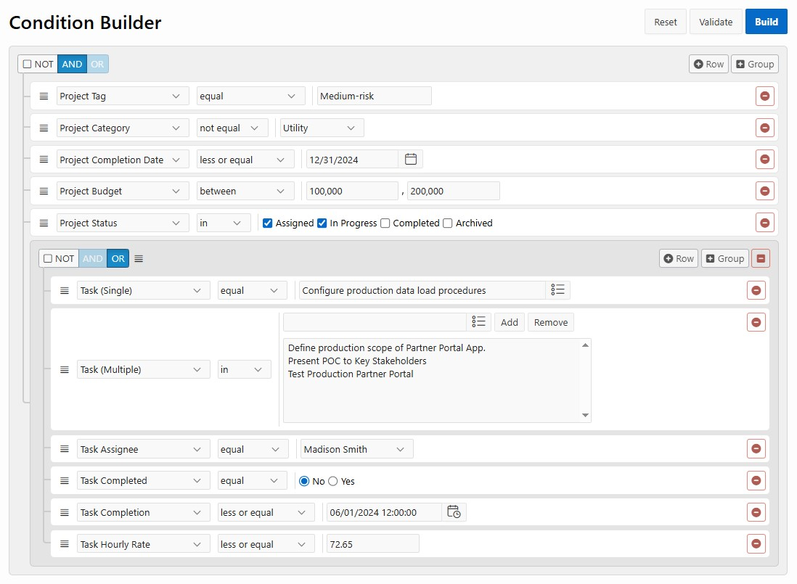

# apex-condition-builder
<p>Region plugin wrapping jQuery QueryBuilder enabling you to visually build logical conditions like filter- and rule conditions.
It has customizations for styling, incorporating of APEX components like Date Picker and Popup LOV, and the building of the actual conditions is supported by server-side PL/SQL code (as to further defend against SQL injection, next to the use of prepared statements).</p>
<p>For jQuery QueryBuilder, see: https://github.com/mistic100/jQuery-QueryBuilder</p>
<p>

</p>

See this [blog item](https://karelekema.hashnode.dev/oracle-apex-condition-builder-plugin) for an overview of the functionality. 
<p>
After importing the plugin, you can create a page with a new region, and select 'LIB4X - Condition Builder' as the region type:
</p>


Region Attributes:


```
function(options)
{
    options.queryBuilder.filters = cb.filters;
    options.queryBuilder.rules = cb.rules;
    return options;
}
```

For the example, lets define the filters and the rules in: Page - Function and Global Variable Declaration:

```
let cb = {};
cb.rules = {
    condition: 'AND',
    rules: [
    {
        id: 'prjtag',
        operator: 'equal',
        value: 'Medium-risk'
    }, 
    {
        id: 'prjcategory',
        operator: 'not_equal',
        value: 4
    },     
    {
        id: 'prjcompletiondate',
        operator: 'less_or_equal',
        value: '12/31/2024'
    },
    {
        id: 'prjbudget',
        operator: 'between',
        value: [100000,200000]
    },
    {
        id: 'prjstatus',
        operator: 'in',
        value: ['ASSIGNED','IN-PROGRESS']
    },               
    {
        condition: 'OR',
        rules: [
        {
            id: 'taskid',
            operator: 'equal',
            value: 93,
            displayValue: 'Configure production data load procedures'
        },
        {
            id: 'taskassignee',
            operator: 'equal',
            value: 6
        },        
        {
            id: 'taskcompleted',
            operator: 'equal',
            value: 'N'
        },
        {
            id: 'taskcompletiondatetime',
            operator: 'less_or_equal',
            value: '06/01/2024 12:00:00'
        },
        {
            id: 'taskhourlyrate',
            operator: 'less_or_equal',
            value: 72.65
        }]
    }]
};
cb.filters = [
    {
        id: 'prjtag',
        field: 'PRJ_TAG',
        label: 'Project Tag',
        type: 'string',
        value_separator: ','
    }, 
    {
        id: 'prjcategory',
        field: 'PRJ_CATEGORY',
        label: 'Project Category',
        type: 'integer',
        input: 'select',
        values: {
            1: 'Maintenance',
            2: 'Construction',
            3: 'Installation',
            4: 'Utility',
            5: 'Energy',
            6: 'Telecom'
        },
        operators: ['equal', 'not_equal', 'is_null', 'is_not_null']
    }, 
    {
        id: 'prjcompletiondate',
        field: 'PRJ_COMPLETION_DATE',
        label: 'Project Completion Date',
        type: 'date',
        operators: ['equal', 'not_equal', 'less', 'less_or_equal', 'greater', 'greater_or_equal', 'between', 'not_between', 'is_empty', 'is_not_empty']        
    },
    {
        id: 'prjbudget',
        field: 'PRJ_BUDGET',
        label: 'Project Budget',
        type: 'double',  
        apex:{    
            formatMask: '999G999G999G999G990'
        },     
        input: 'number',
        operators: ['equal', 'not_equal', 'less', 'less_or_equal', 'greater', 'greater_or_equal', 'between', 'not_between', 'is_null', 'is_not_null']         
    }, 
    {
        id: 'prjstatus',
        field: 'PRJ_STATUS',
        label: 'Project Status',
        type: 'string',
        input: 'checkbox',
        values: {
            'ASSIGNED': 'Assigned',
            'IN-PROGRESS': 'In Progress',
            'COMPLETED': 'Completed',
            'ARCHIVED': 'Archived'
        },
        vertical: false,
        operators: ['in', 'not_in']
    },         
    {
        id: 'taskid',
        field: 'TASK_ID',
        label: 'Task',
        type: 'integer',     
        input: 'select',            
        apex:{
            referenceItem: 'P10_TASK',
            width: 50
        },
        operators: ['equal', 'not_equal']           
    },         
    {
        id: 'taskcompleted',
        field: 'TASK_COMPLETED',
        label: 'Task Completed',
        type: 'string',
        input: 'radio',        
        values: {
            'N': 'No',
            'Y': 'Yes'
        },
        operators: ['equal', 'not_equal']
    }, 
    {
        id: 'taskcompletiondatetime',
        field: 'TASK_COMPLETION_DATETIME',
        label: 'Task Completion',
        type: 'datetime',     
        apex: {
            formatMask: 'MM/DD/YYYY HH24:MI:SS'
        },  
        operators: ['less_or_equal', 'greater_or_equal', 'between']           
    },
    {
        id: 'taskassignee',
        field: 'TASK_ASSIGNEE',
        label: 'Task Assignee',
        type: 'integer',
        input: 'select',
        apex:{
            referenceItem: 'P10_ASSIGNEE'
        },
        operators: ['equal', 'not_equal', 'is_null', 'is_not_null']
    },
    {
        id: 'taskhourlyrate',
        field: 'TASK_HOURLY_RATE',
        label: 'Task Hourly Rate',
        type: 'double',  
        apex:{    
            formatMask: '999G999G999G999G990D00'
        },     
        input: 'number',
        operators: ['less_or_equal', 'greater_or_equal', 'between'],
        validation:{
            min: 22,
            max: 95
        }                 
    }                         
];
```
For a description on the configuration options, see the [jQuery QueryBuilder documentation](https://querybuilder.js.org/index.html).

In few places, an APEX extension is supported. For integer/double/date filter types, you can specify a formatMask. For filters with input 'select', instead of specifying values, you can reference an APEX item - which can be here an APEX item of type 'Select' or 'Popup LOV'. An approach can be to have these items in a hidden subregion:


For any 'Popup LOV' item, configure the 'Display As' settings as 'Modal Dialog'.

Now, you can add a 'Build' button to the region as to build the actual conditions:


First JavaScript action:

```
apex.item('P10_SERVER_ERROR').setValue('');
apex.message.clearErrors();
if (apex.region('cb_demo').validate())
{
    let jsonResult = apex.region('cb_demo').getRules();
    apex.item('P10_DEFINITION').setValue(JSON.stringify(jsonResult, null, 2));
}
else
{
    apex.message.showErrors( [
        {
            type:       "error",
            location:   "page",
            message:    "Validation errors",
            unsafe:     false
        }
    ] );     
}
```

The apex.region('cb_demo').getRules() calls the jQuery QueryBuilder getRules() API as to arrive at the JSON definition of the Rule Set, which makes up the composite Condition. This definition is used in the next step in PL/SQL:

```
declare
    l_condition_rec lib4x_condition.t_condition_rec;
begin
    APEX_UTIL.SET_SESSION_STATE('P10_SERVER_ERROR', null);  
    l_condition_rec := lib4x_condition.build(:P10_DEFINITION, false, true);
    APEX_UTIL.SET_SESSION_STATE('P10_DISPLAY_CONDITION', l_condition_rec.display_condition);
    APEX_UTIL.SET_SESSION_STATE('P10_FILTER_CONDITION', l_condition_rec.filter_condition);
    APEX_UTIL.SET_SESSION_STATE('P10_RULE_CONDITION', l_condition_rec.rule_condition);
    APEX_UTIL.SET_SESSION_STATE('P10_PARAMETERS', l_condition_rec.display_params);
exception
    when others then
        APEX_UTIL.SET_SESSION_STATE('P10_SERVER_ERROR', SQLERRM);
end;
```


The pl/sql code is in the LIB4X_CONDITION package. The source you find in the src/plsql folder.

As last step, we give in JavaScript the feedback:

```
let serverError = apex.item('P10_SERVER_ERROR').getValue();
if (serverError)
{
    apex.message.showErrors(
        {
            type:       "error",
            location:   "page",
            message:    serverError
        }
    );
}
else
{
    apex.message.showPageSuccess( "Condition build succesfully" );
}
```
<hr>

This software uses [jQuery QueryBuilder](https://querybuilder.js.org/api/), which is licensed under the MIT License.<br>
Copyright (c) 2014-2018 Damien Sorel<br>
[License](https://github.com/mistic100/jQuery-QueryBuilder/blob/dev/LICENSE) | [Project](https://github.com/mistic100/jQuery-QueryBuilder)


